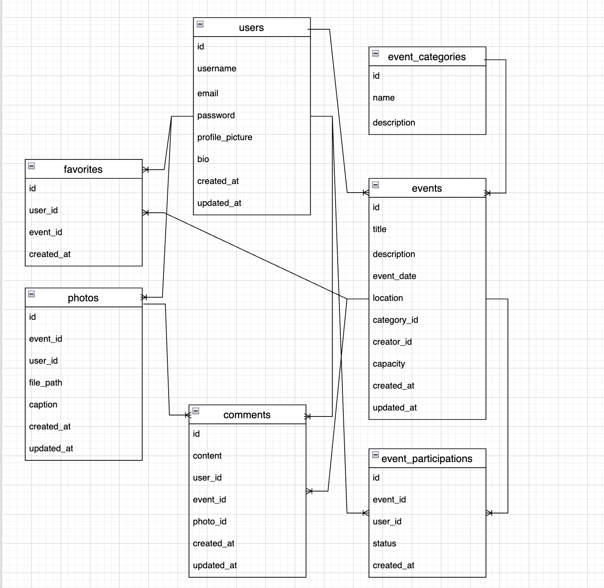

# イベント情報共有プラットフォーム「EventShare」設計書

## 1. プロジェクト概要

### 1.1 目的
イベント情報を共有し、写真投稿や参加者同士の交流を可能にするプラットフォームを構築する。

### 1.2 開発背景
自身の野球観戦・お笑い鑑賞・カメラ趣味から、同じ趣味を持つ人々との交流や、イベント情報の共有、撮影した写真を共有できる場があると便利だと考えた。

### 1.3 ターゲットユーザー
- 同じ趣味を持つ人との交流を求める人

### 1.4 主な機能概要
- ユーザー登録・認証機能
- イベント登録・検索機能
- イベント参加登録機能
- 写真投稿・共有機能
- コメント・レビュー機能
- お気に入り登録機能

## 2. 技術スタック

### 2.1 バックエンド
- 言語：Java 17
- フレームワーク：Spring Boot 3.4.5
- ビルドツール：Gradle
- データベース：PostgreSQL
- ORM：Spring Data JPA
- 認証：Spring Security + JWT
- API文書化：SpringDoc (Swagger)

### 2.2 インフラ
- Docker/Docker Compose
- GitHub Actions（CI/CD）

### 2.3 その他ツール・ライブラリ
- Lombok
- MapStruct
- JUnit5
- Mockito

## 3. データベース設計

### 3.1 エンティティ関連図


### 3.2 エンティティ詳細

#### 3.2.1 ユーザー（users）
| フィールド           | 型         | 説明           |
|-----------------|-----------|--------------|
| id              | Long      | 主キー、自動採番     |
| username        | String    | ユーザー名（一意）    |
| email           | String    | メールアドレス（一意）  |
| password        | String    | パスワード（ハッシュ化） |
| profile_picture | String    | プロフィール画像のパス  |
| bio             | String    | 自己紹介         |
| created_at      | Timestamp | 作成日時         |
| updated_at      | Timestamp | 更新日時         |

#### 3.2.2 イベントカテゴリ（event_categories）
| フィールド       | 型      | 説明        |
|-------------|--------|-----------|
| id          | Long   | 主キー、自動採番  |
| name        | String | カテゴリ名（一意） |
| description | String | カテゴリの説明   |

#### 3.2.3 イベント（events）
| フィールド       | 型         | 説明           |
|-------------|-----------|--------------|
| id          | Long      | 主キー、自動採番     |
| title       | String    | イベントタイトル     |
| description | String    | イベント説明       |
| event_date  | Timestamp | イベント開催日時     |
| location    | String    | 開催場所         |
| category_id | Long      | カテゴリID（外部キー） |
| creator_id  | Long      | 作成者ID（外部キー）  |
| capacity    | Integer   | 定員           |
| created_at  | Timestamp | 作成日時         |
| updated_at  | Timestamp | 更新日時         |

#### 3.2.4 イベント参加（event_participations）
| フィールド      | 型         | 説明                     |
|------------|-----------|------------------------|
| id         | Long      | 主キー、自動採番               |
| event_id   | Long      | イベントID（外部キー）           |
| user_id    | Long      | ユーザーID（外部キー）           |
| status     | Enum      | 参加ステータス（参加確定、キャンセル待ち等） |
| created_at | Timestamp | 作成日時（参加登録日時）           |

#### 3.2.5 写真（photos）
| フィールド      | 型         | 説明           |
|------------|-----------|--------------|
| id         | Long      | 主キー、自動採番     |
| event_id   | Long      | イベントID（外部キー） |
| user_id    | Long      | 投稿者ID（外部キー）  |
| file_path  | String    | 画像ファイルのパス    |
| caption    | String    | キャプション       |
| created_at | Timestamp | 作成日時         |
| updated_at | Timestamp | 更新日時         |

#### 3.2.6 コメント（comments）
| フィールド      | 型         | 説明                  |
|------------|-----------|---------------------|
| id         | Long      | 主キー、自動採番            |
| content    | String    | コメント内容              |
| user_id    | Long      | コメント投稿者ID（外部キー）     |
| event_id   | Long      | イベントID（外部キー、NULL許容） |
| photo_id   | Long      | 写真ID（外部キー、NULL許容）   |
| created_at | Timestamp | 作成日時                |
| updated_at | Timestamp | 更新日時                |

#### 3.2.7 お気に入り（favorites）
| フィールド      | 型         | 説明           |
|------------|-----------|--------------|
| id         | Long      | 主キー、自動採番     |
| user_id    | Long      | ユーザーID（外部キー） |
| event_id   | Long      | イベントID（外部キー） |
| created_at | Timestamp | 作成日時         |

### 3.3 リレーションシップ
- users - events: 1対多（ユーザーがイベントを作成）
- users - event_participations: 1対多（ユーザーがイベントに参加）
- events - event_participations: 1対多（イベントに複数のユーザーが参加）
- events - photos: 1対多（イベントに複数の写真が投稿される）
- users - photos: 1対多（ユーザーが写真を投稿）
- users - comments: 1対多（ユーザーがコメントを投稿）
- events - comments: 1対多（イベントに対してコメントが投稿される）
- photos - comments: 1対多（写真に対してコメントが投稿される）
- users - favorites: 1対多（ユーザーが複数のイベントをお気に入り登録）
- events - favorites: 1対多（イベントが複数のユーザーにお気に入り登録される）

## 4. API設計

### 4.1 認証関連API

#### 4.1.1 ユーザー登録
- エンドポイント: `POST /api/auth/register`
- 認証: 不要
- リクエスト:
  ```json
  {
    "username": "baseball_fan",
    "email": "fan@example.com",
    "password": "secure_password"
  }
  ```
- レスポンス (成功 - 201 Created):
  ```json
  {
    "id": 1,
    "username": "baseball_fan",
    "email": "fan@example.com",
    "createdAt": "2025-05-05T10:30:00"
  }
  ```

#### 4.1.2 ログイン
- エンドポイント: `POST /api/auth/login`
- 認証: 不要
- リクエスト:
  ```json
  {
    "username": "baseball_fan",
    "password": "secure_password"
  }
  ```
- レスポンス (成功 - 200 OK):
  ```json
  {
    "token": "tplafakfagajafdaf",
    "type": "Bearer",
    "id": 1,
    "username": "baseball_fan",
    "email": "fan@example.com"
  }
  ```

### 4.2 ユーザー関連API

#### 4.2.1 ユーザー情報取得
- エンドポイント: `GET /api/users/{id}`
- 認証: 必須
- レスポンス (成功 - 200 OK):
  ```json
  {
    "id": 1,
    "username": "baseball_fan",
    "email": "fan@example.com",
    "profilePicture": "uploads/profile/fogefoge.jpg",
    "bio": "野球観戦が大好きです。",
    "createdAt": "2025-05-05T10:30:00"
  }
  ```

#### 4.2.2 ユーザー情報更新
- エンドポイント: `PUT /api/users/{id}`
- 認証: 必須（自身のみ更新可能）
- リクエスト:
  ```json
  {
    "bio": "野球観戦とカメラが大好きです。",
    "profilePicture": "画像データ"
  }
  ```
- レスポンス (成功 - 200 OK):
  ```json
  {
    "id": 1,
    "username": "baseball_fan",
    "email": "fan@example.com",
    "profilePicture": "uploads/profile/fogefoge.jpg",
    "bio": "野球観戦とカメラが大好きです。",
    "updatedAt": "2025-05-05T11:45:00"
  }
  ```

### 4.3 イベント関連API

#### 4.3.1 イベント一覧取得
- エンドポイント: `GET /api/events`
- 認証: 不要
- クエリパラメータ:
    - category: カテゴリID（フィルタリング用）
    - search: 検索キーワード
    - startDate: 開始日
    - endDate: 終了日
    - page: ページ番号
    - size: ページサイズ
- レスポンス (成功 - 200 OK):
  ```json
  {
    "content": [
      {
        "id": 1,
        "title": "阪神vsヤクルト 神宮球場",
        "description": "プロ野球セ・リーグ 阪神対ヤクルト戦",
        "eventDate": "2025-05-15T18:00:00",
        "location": "神宮球場",
        "category": {
          "id": 1,
          "name": "野球"
        },
        "creator": {
          "id": 1,
          "username": "baseball_fan"
        },
        "participantCount": 15,
        "capacity": 50
      }
    ],
    "pageable": {
      "pageNumber": 0,
      "pageSize": 10,
      "totalElements": 42,
      "totalPages": 5
    }
  }
  ```

#### 4.3.2 イベント作成
- エンドポイント: `POST /api/events`
- 認証: 必須
- リクエスト:
  ```json
  {
    "title": "阪神vsヤクルト 神宮球場",
    "description": "プロ野球セ・リーグ 阪神対ヤクルト戦",
    "eventDate": "2025-05-15T18:00:00",
    "location": "神宮球場",
    "categoryId": 1,
    "capacity": 50
  }
  ```
- レスポンス (成功 - 201 Created):
  ```json
  {
    "id": 1,
    "title": "阪神vsヤクルト 神宮球場",
    "description": "プロ野球セ・リーグ 阪神対ヤクルト戦",
    "eventDate": "2025-05-15T18:00:00",
    "location": "神宮球場",
    "category": {
      "id": 1,
      "name": "野球"
    },
    "creator": {
      "id": 1,
      "username": "baseball_fan"
    },
    "participantCount": 0,
    "capacity": 50,
    "createdAt": "2025-05-05T10:30:00"
  }
  ```

#### 4.3.3 イベント詳細取得
- エンドポイント: `GET /api/events/{id}`
- 認証: 不要
- レスポンス (成功 - 200 OK):
  ```json
  {
    "id": 1,
    "title": "阪神vsヤクルト 神宮球場",
    "description": "プロ野球セ・リーグ 阪神対ヤクルト戦",
    "eventDate": "2025-05-15T18:00:00",
    "location": "神宮球場",
    "category": {
      "id": 1,
      "name": "野球"
    },
    "creator": {
      "id": 1,
      "username": "baseball_fan"
    },
    "participantCount": 15,
    "capacity": 50,
    "createdAt": "2025-05-05T10:30:00",
    "participants": [
      {
        "id": 2,
        "username": "tigers_fun"
      }
    ]
  }
  ```

### 4.4 イベント参加関連API

#### 4.4.1 イベント参加登録
- エンドポイント: `POST /api/events/{id}/participate`
- 認証: 必須
- レスポンス (成功 - 201 Created):
  ```json
  {
    "id": 1,
    "event": {
      "id": 1,
      "title": "阪神vsヤクルト 神宮球場"
    },
    "user": {
      "id": 2,
      "username": "tigers_fun"
    },
    "status": "CONFIRMED",
    "createdAt": "2025-05-05T14:30:00"
  }
  ```

#### 4.4.2 イベント参加キャンセル
- エンドポイント: `DELETE /api/events/{id}/participate`
- 認証: 必須
- レスポンス (成功 - 204 No Content)

### 4.5 写真関連API

#### 4.5.1 写真投稿
- エンドポイント: `POST /api/photos`
- 認証: 必須
- リクエスト: `multipart/form-data`
    - photo: 写真ファイル
    - eventId: イベントID
    - caption: キャプション
- レスポンス (成功 - 201 Created):
  ```json
  {
    "id": 1,
    "filePath": "uploads/photos/event1/photo1.jpg",
    "caption": "ヤクルト戦",
    "event": {
      "id": 1,
      "title": "阪神vsヤクルト 神宮球場"
    },
    "user": {
      "id": 2,
      "username": "tigers_fun"
    },
    "createdAt": "2025-05-15T21:30:00"
  }
  ```

#### 4.5.2 イベント写真一覧取得
- エンドポイント: `GET /api/events/{id}/photos`
- 認証: 不要
- クエリパラメータ:
    - page: ページ番号
    - size: ページサイズ
- レスポンス (成功 - 200 OK):
  ```json
  {
    "content": [
      {
        "id": 1,
        "filePath": "uploads/photos/event1/photo1.jpg",
        "caption": "ヤクルト戦",
        "user": {
          "id": 2,
          "username": "tigers_fun"
        },
        "createdAt": "2025-05-15T21:30:00"
      }
    ],
    "pageable": {
      "pageNumber": 0,
      "pageSize": 10,
      "totalElements": 24,
      "totalPages": 3
    }
  }
  ```

### 4.6 コメント関連API

#### 4.6.1 イベントコメント投稿
- エンドポイント: `POST /api/events/{id}/comments`
- 認証: 必須
- リクエスト:
  ```json
  {
    "content": "素晴らしい試合でした！"
  }
  ```
- レスポンス (成功 - 201 Created):
  ```json
  {
    "id": 1,
    "content": "素晴らしい試合でした！",
    "user": {
      "id": 2,
      "username": "tigers_fun"
    },
    "event": {
      "id": 1,
      "title": "阪神vsヤクルト 神宮球場"
    },
    "createdAt": "2025-05-15T22:30:00"
  }
  ```

#### 4.6.2 写真コメント投稿
- エンドポイント: `POST /api/photos/{id}/comments`
- 認証: 必須
- リクエスト:
  ```json
  {
    "content": "素晴らしい写真ですね！"
  }
  ```
- レスポンス (成功 - 201 Created):
  ```json
  {
    "id": 2,
    "content": "素晴らしい写真ですね！",
    "user": {
      "id": 3,
      "username": "photo_lover"
    },
    "photo": {
      "id": 1,
      "caption": "ヤクルト戦"
    },
    "createdAt": "2025-05-16T09:15:00"
  }
  ```

### 4.7 検索API

#### 4.7.1 イベント検索
- エンドポイント: `GET /api/search/events`
- 認証: 不要
- クエリパラメータ:
    - keyword: 検索キーワード
    - category: カテゴリID
    - startDate: 開始日
    - endDate: 終了日
    - location: 場所
    - page: ページ番号
    - size: ページサイズ
- レスポンス: イベント一覧と同様

## 5. 認証・認可設計

### 5.1 認証方式
- JWT (JSON Web Token) を使用
- トークン有効期限: 24時間
- リフレッシュトークン: あり（有効期限7日）

### 5.2 認可ポリシー
| リソース   | 作成       | 閲覧   | 更新    | 削除    |
|--------|----------|------|-------|-------|
| ユーザー情報 | 誰でも可     | 誰でも可 | 本人のみ  | 本人のみ  |
| イベント   | ログインユーザー | 誰でも可 | 作成者のみ | 作成者のみ |
| イベント参加 | ログインユーザー | 誰でも可 | 本人のみ  | 本人のみ  |
| 写真     | ログインユーザー | 誰でも可 | 投稿者のみ | 投稿者のみ |
| コメント   | ログインユーザー | 誰でも可 | 投稿者のみ | 投稿者のみ |

## 6. パッケージ構成

```
com.eventshare.app
├── config/          - アプリケーション設定
│   ├── SecurityConfig.java
│   ├── JwtConfig.java
│   └── WebConfig.java
├── controller/      - APIエンドポイント
│   ├── AuthController.java
│   ├── UserController.java
│   ├── EventController.java
│   ├── PhotoController.java
│   └── CommentController.java
├── dto/             - データ転送オブジェクト
│   ├── request/
│   │   ├── LoginRequest.java
│   │   ├── RegisterRequest.java
│   │   ├── EventRequest.java
│   │   └── ...
│   └── response/
│       ├── JwtResponse.java
│       ├── UserResponse.java
│       ├── EventResponse.java
│       └── ...
├── entity/          - データベースエンティティ
│   ├── User.java
│   ├── Event.java
│   ├── EventCategory.java
│   ├── EventParticipation.java
│   ├── Photo.java
│   ├── Comment.java
│   └── Favorite.java
├── repository/      - データアクセス
│   ├── UserRepository.java
│   ├── EventRepository.java
│   ├── EventCategoryRepository.java
│   ├── EventParticipationRepository.java
│   ├── PhotoRepository.java
│   ├── CommentRepository.java
│   └── FavoriteRepository.java
├── service/         - ビジネスロジック
│   ├── AuthService.java
│   ├── UserService.java
│   ├── EventService.java
│   ├── PhotoService.java
│   └── CommentService.java
├── exception/       - 例外処理
│   ├── GlobalExceptionHandler.java
│   ├── ResourceNotFoundException.java
│   ├── UnauthorizedException.java
│   └── BadRequestException.java
├── security/        - セキュリティ関連
│   ├── JwtTokenProvider.java
│   ├── JwtAuthenticationFilter.java
│   └── UserDetailsServiceImpl.java
└── util/            - ユーティリティクラス
    ├── FileStorageUtil.java
    └── DateTimeUtil.java
```

## 7. 開発計画

### 7.1 フェーズ分け

#### フェーズ1: 基盤構築
- プロジェクト設定
- データベース設計・マイグレーション
- 認証基盤実装
- エンティティ・リポジトリ作成

#### フェーズ2: コア機能実装
- ユーザー管理機能
- イベント管理機能
- イベント参加機能
- 基本検索機能

#### フェーズ3: 追加機能実装
- 写真投稿・管理機能
- コメント機能
- お気に入り機能
- 高度な検索・フィルタリング

#### フェーズ4: 品質向上
- 単体テスト・統合テスト
- API文書化
- パフォーマンス最適化
- セキュリティ強化


## 8. テスト計画

### 8.1 単体テスト
- サービスレイヤーの各メソッドをテスト
- モックを使用してリポジトリとの依存関係を分離

### 8.2 統合テスト
- コントローラーAPIエンドポイントのテスト
- データベース操作を含めた一連の流れをテスト

### 8.3 セキュリティテスト
- 認証・認可のテスト
- エンドポイントのアクセス制御テスト

## 9. 将来的な拡張可能性

- プッシュ通知機能
- リアルタイムチャット機能
- ソーシャルメディア連携
- レコメンデーション機能
- モバイルアプリ対応

---

この設計書は開発の指針とし、必要に応じて更新していきます。